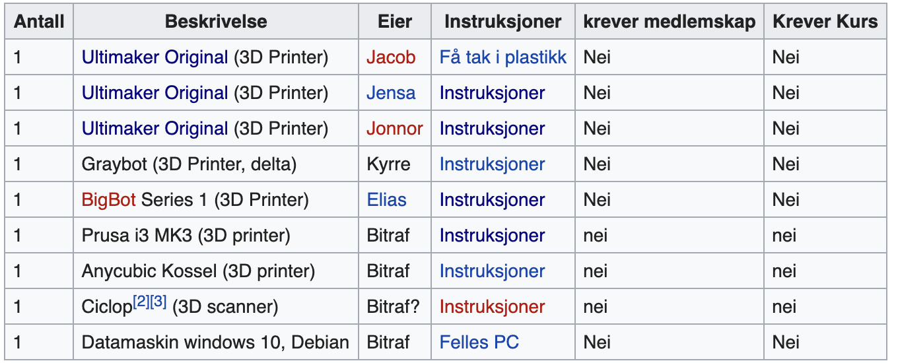

# 3D printers at bitraf

## There are 10 3D printers
Most of these doesn't work at the moment. Plants to upgrade and fix seems limited. This means there might be ample opportunity to get stuff done using only initiative. However, this increases the amount of work significantly. 

The 10 printers are:
- 3 Ultimaker originals with custom upgrades (doesn't work)
    - NotBot
    - BoxBot
    - YarrBot (doesn't work, getting thrown?)
- 1 Series 1 Pro 3001 (works? failed testing)
    - Bigbot
- 1 ANYCUBIC (works?)
- 1 Original Prusa (*teste, works*)
- 1 printbot plus
- 1 Vertex, welleman (doesn't work, getting thrown?)
- 1 Home made printer called Blackbot
- 1 Small home made printer

## The online information is outdated
bitraf has some [information](https://bitraf.no/wiki/3D_printer) regarding its 3D printers

- [Ultimaker Original](https://bitraf.no/wiki/Ultimaker_Original) 
- [Bigbot](https://bitraf.no/wiki/Bigbot_Instruksjoner) 
- [Blackbot](https://bitraf.no/wiki/Blackbot_Instruksjoner)

At the moment, only bigbot from the list is working.

## There is a second list with updated information 

If you check out [this](https://bitraf.no/wiki/Utstyr_på_Bitraf#Utstyr_i_3D-printer-rommet) you will find information on 7 of the printers. 

There information on each of these links
It might be possible to get stuff to work after some testing

## Testing of Bigbot
- This uses octoprint which is a online interface for printing
- Cura marketplace has a plugin that allows you to connect to octoprint
- It seems it is intentionally hard to get to work at bitraf
- Uploading the stl files directly to the octoprint server and doing the slicing there seems to be the easiest way
- For å gjøre det er det bare å logge på bitraf nettet og 
gå til http://bigbot.local
- Første print var av shouldershell.stl, det feilet 
- Konklusjon, platen under er for slitt til at bifgbot kan brukes

## Testing of ANYCUBIC
- Klarte ikke å bytte filament på denne
- Det ligger en lapp som sier at det ble installert men ikke testet i mars
- Med litt prøving og feiling klarte jeg å bytte filament (Det er veldig likt atomic pull for ultimaker)
- Klarer jeg leveling kan denne skrive ut alle deler ...
- Vi har funnet orginal [instruksjonen](https://bitraf.no/wiki/Anycubic_3D_printer)

## Testing av Orinal Prusa
- Tested with the prusa slicer
- It need sd cards. To get information from mac to a SD card, use [this](https://www.dropbox.com/sh/zbifeqytlzn26l5/AAAw1eMunT_47RaJop2QJn_ya?dl=0) dropbox folder. It has the bitraf computer as one of its users

## Testing of printbot plus

